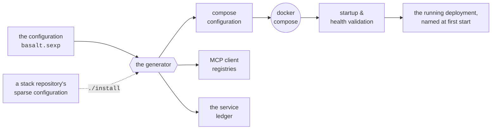
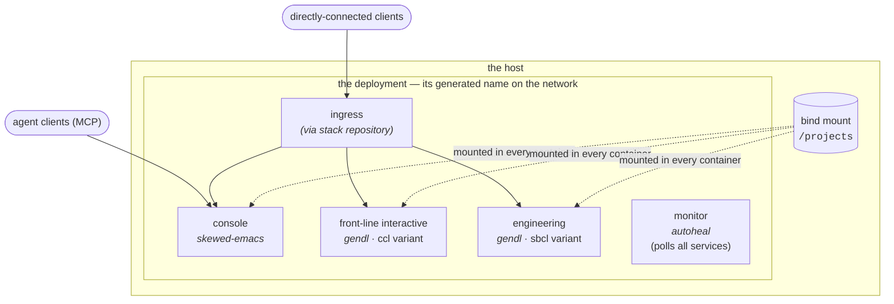

# BASALT

**Basalt** is a containerized service stack — a *deployment* —
assembled by generation from one declared configuration. Deployments
come in many shapes and sizes; the standard one runs an interactive
**console**, two **engine services**, and a **monitor**, together on
one host. A deployment receives a generated name at first start and
keeps it; the Docker network its services join carries that name.

This document describes the architecture which, followed faithfully
by the build tooling, produces a standard Basalt deployment. The
operating manual — starting, stopping, connecting — is
[README.md](README.md).

Basalt is the Genworks-maintained fork of Basilisk, and this document
is a register-for-register translation of upstream's
[BASILISK.md](https://github.com/gornskew/basilisk/blob/devo/BASILISK.md):
same architecture, plain vocabulary.

## The repositories

Everything about a deployment lives in repositories, one repository
per idea:

- **The base repository** is this one. It carries the base
  configuration, the generator, and the compose setup for a standard
  deployment. One clone runs one deployment (or several instances,
  each under its own name).
- **A stack repository** sits beside the base, one per deployment
  design that deviates from the standard. It carries *sparse*
  configuration — only the deviations and additions — and its
  `./install` copies the generated outputs into the base checkout.
- **A fork** is a system of its own: rename the repository, name the
  configuration file to match, and cut the service list to taste.
  The generator derives everything from the directory name.
  Deployments produced from forks are not guaranteed to be standard
  Basalt.

From the configuration, everything else is generated:

Configuration that must name other services — an ingress's routing
rules, a services-init hook — names a **role**, and the generator
resolves it against the service ledger at start time, so the rules
survive service renames.

## The configuration

Every service is listed in the configuration, and only one thing must
be stated about each: the **image**. Everything else can be left to
the tooling's defaults.

- A service assigned a role answers to a hostname derived from its
  role or roles — `captain`, `engineer`, perhaps `engineer-2` for
  multiples.
- An image deployed with **no assigned role** is entered on the
  roster as **unassigned**, and named `unassigned-<repo>` — the name
  itself is the declaration, legible at a glance. So, refining the
  first rule: state *two* things (image, role) when you want a
  service guaranteed to fill that role.

The configuration is sparse on purpose: state what deviates from the
defaults, and inherit the rest.

## Roles and images

A **role** says what a service is *for*; an **image** says what it
*is*, and what, purportedly, it is capable of doing. Three
identifiers attach to every container, from three different sources:
the *role* (declared, or read off the hostname), the *image
reference* (declared in the configuration), and a generated
*instance name* (assigned at startup, kept for the container's
lifetime). A container may descend from any amount of history, but
each fresh container should be treated as exactly that — a fresh
instance with a fresh name.

- Each role lists its required capabilities in the `:postings` table
  of the configuration. Requirements only — the table is not a
  service catalogue.
- Each image states its capabilities in its own manifest (the
  `basilisk.capabilities` label), which travels with the image. The
  build system maintains no registry of images and never adjudicates
  whether an image is fit for a role.
- Where an image comes from is its **registry namespace**. In
  principle any image can come from any registry; knowing each
  image's origin lets the operator report misbehavior — or notably
  good behavior — upstream, where such reports are typically
  received gratefully, either way.

On capability gaps: at startup, each service's manifest is read
against the requirements of every role it fills. A service that
cannot show a required capability draws a **warning — and startup
proceeds**. That is the deliberate policy: a mis-assigned service
causes no failure and no delay, because many capabilities can be
added at runtime (a services-init hook, at boot or later), which no
manifest can show in advance.

## The standard services

| role | usual image | duty |
|---|---|---|
| **console** | *skewed-emacs* | the interactive control surface; receives and routes connecting agents personally; the longest-lived process in the stack |
| **front-line interactive** | *gendl*, `ccl` variant | assists the console, its users, and its guests |
| **engineering** | *gendl*, `sbcl` variant | computation and geometry, for the stack and its users |
| **monitor** | *autoheal* | continuously polls for hung services, and restarts them |

Two further roles are declared in the configuration with **no
service in the standard set** — their required capabilities are
stated, and a service to fill them arrives by stack repository:

| role | duty |
|---|---|
| **ingress** | ships with full routing configuration; receives, identifies, and routes everything arriving from outside |
| **dashboard** | polls status reports from services, and from other deployments of interest; renders them on one monitoring board |

## Configuration authority

The **console is where the deployment's operating configuration is
authored** — authority over the rules the stack runs by, exercised by
writing them. Authority, not traffic: nothing routes *through* the
console on that account.

Two functions are deliberately unassigned, and named so they are not
quietly conflated with that one:

- **Request forwarding** has no dedicated service by default; it
  falls to the console's written rules, or to automation.
- **Deployment decisions** — where the stack should run, what it
  should become — are made from outside the stack, by you, the
  operator. No service carries them.

Though it happens comparatively rarely, deployments do move: a stack
may be stopped on one host and started on another, and a host itself
may be migrated with its deployments aboard.

## The ingress

**Deployments with an ingress receive outside traffic more
productively.** The ingress's job is knowing who is who and what is
what — the working services are poor at exactly that, because they
are busy with their own work. Without an ingress, outside requests
land directly on the console or the engines through published ports:
no notice, no identification, no vetting.

## What arrives

Traffic arriving at a deployment falls into three categories:

| arriving | what it is |
|---|---|
| **inputs** | raw data, brought in to be worked on |
| **outputs** | processed or produced: the finished artifact, or an ingredient for the next |
| **clients** | connections with business here, human and agent alike. Agent (MCP) clients always land at the console first — the MCP wrapper layer runs there — before acting on the service they name. |

Any service may accept a directly-connected client at its own
discretion; such connections bypass any ingress and reach the
service's own port.

## The console toolkit

The console's image name (skewed-emacs) undersells its capabilities
considerably. The editor everyone names the image after is merely
the best-known tool aboard:

| tool | for |
|---|---|
| the editor and its daemon | reading and writing — the work itself |
| the MCP receiving layer | when agent clients connect (through the ingress or directly), this layer receives each one, identifies it, and routes it where it belongs |
| **webshot** | headless browser capture: renders a live page as it *actually* appears, rather than as intended. Not in every image variant — a lightly-built console lacks it, and finds out the hard way |
| the web terminal | lets anyone the operator permits, users and agents alike, work at the console from a browser |

## Lifecycle

Deployments undergo full recreates, host rebuilds, and other
maintenance events. A container keeps its generated instance name
across a plain restart; a **recreate** brings up an all-new set of
containers on the same deployment. A container's run ends one of
four ways:

| cause | what happened |
|---|---|
| *recreated* | the containers were replaced; the deployment and its name persisted |
| *host rebuild* | the host went down or was rebuilt; containers gone, configuration remains |
| *died* | this container failed in service |
| *lost* | gone without a recorded cause |
